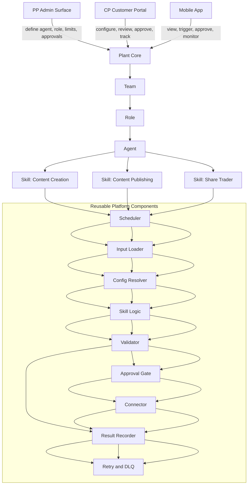
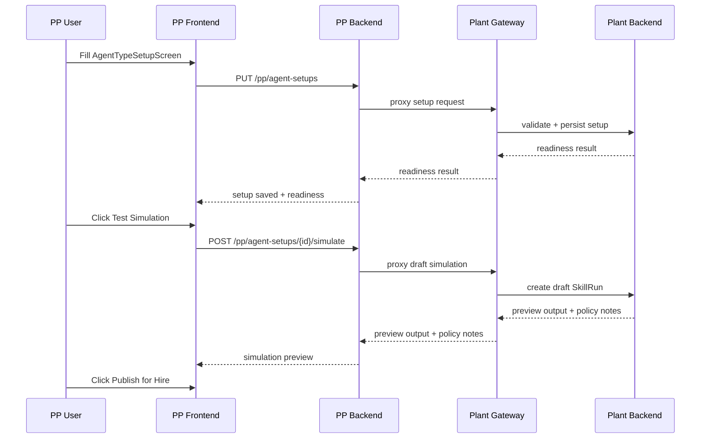
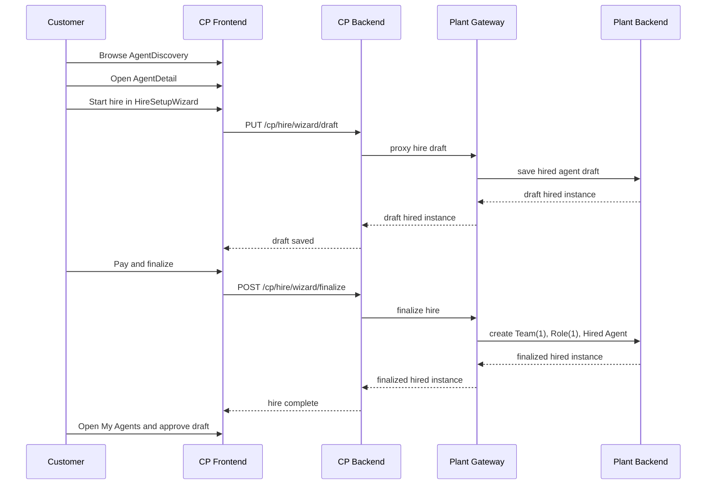
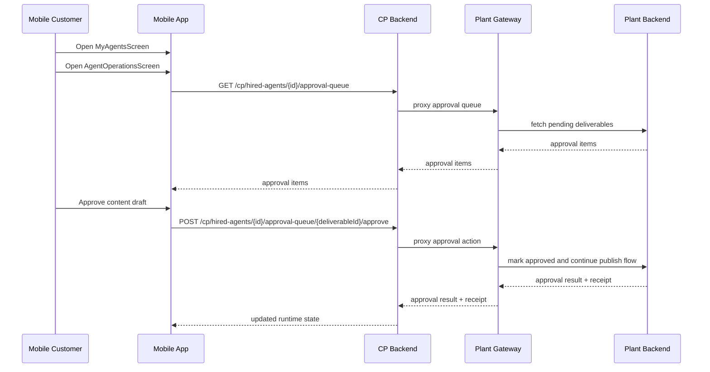
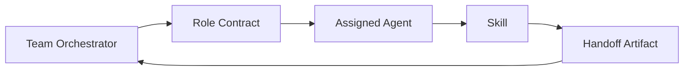

# WAOOAW Design

## Document Metadata

| Field | Value |
|---|---|
| Document ID | `WAOOAW-DESIGN` |
| Version | `v1` |
| Status | Draft design baseline |
| Parent reference | [docs/CONTEXT_AND_INDEX.md](/workspaces/WAOOAW/docs/CONTEXT_AND_INDEX.md) |
| Related design | [docs/PP/AGENT-CONSTRUCT-DESIGN.md](/workspaces/WAOOAW/docs/PP/AGENT-CONSTRUCT-DESIGN.md) |
| Scope | High-level and low-level design for single-agent-first, team-ready agentic workforce |

## 1. Purpose

WAOOAW should ship fast for small customers who hire one agent, without painting the platform into a corner when larger customers later hire teams of agents.

The design bet in this document is simple: a single-agent hire is treated as the default product now, but the internal model already supports a future where a Team stitches multiple agents together through roles, contracts, and structured handoffs.

## 2. Design Bet

WAOOAW should use this runtime shape:

```text
Team -> Role -> Agent -> Skill -> Component -> SkillRun -> Deliverable
```

For current delivery, most customer hires will behave like this:

```text
One Team -> One Role -> One Agent -> Many Skills -> Reusable Components
```

This keeps the customer-facing experience simple while keeping the platform model ready for coordinated agent teams.

## 3. Core Design Principles

1. Single-agent first, team-ready by design.
2. Components are stateless and replaceable.
3. Skills are assembled from reusable components, not custom pipelines.
4. Agents are packaged workers, not hardcoded workflows.
5. Teams coordinate through explicit handoffs, not hidden shared state.
6. Every unit must be testable in isolation.
7. Every external action must pass approval, policy, and budget gates.
8. PP, CP, and mobile are surfaces over the same Plant runtime, not separate business systems.

## 4. What Each Entity Means

| Entity | Meaning |
|---|---|
| Team | A business delivery unit that groups one or more roles toward one customer outcome |
| Role | A contract for responsibility, permissions, handoff duties, and substitution rules |
| Agent | A packaged runtime worker assigned to a role |
| Skill | One business capability exposed by an agent |
| Component | One stateless execution unit inside a skill |
| SkillRun | One execution record of a skill |
| Deliverable | The stored output or action result from a SkillRun |

## 5. Surface Model

PP, CP, and mobile are not separate product models. They are separate operating surfaces over the same runtime model.

| Surface | Job |
|---|---|
| PP | Define, certify, govern, and monitor teams, roles, agents, skills, and limits |
| CP | Let the customer configure, review, approve, and track hired agents |
| Mobile | Give the customer a lighter runtime surface for status, approvals, and actions |
| Plant | Execute the actual runtime logic, persistence, scheduling, policy, audit, and delivery |

## 6. High-Level Architecture



## 7. Recommended Design Pattern

The best fit for WAOOAW is a mix of five old-school patterns used in a strict order.

| Pattern | Why it fits |
|---|---|
| Composition | Agents are assembled from skills, and skills are assembled from components |
| Strategy | Skill-specific logic changes without changing the platform skeleton |
| Pipeline | Skill execution follows a predictable flow from input to result |
| Orchestrator | Team and role coordination stays explicit and governed |
| Contract-first design | Units can be swapped because they depend on stable interfaces |

This gives WAOOAW plug-and-play behavior without turning the platform into a loose set of ad hoc workflows.

## 8. Single-Agent-First, Team-Ready Model

The immediate product focus is a standalone agent for a small customer.

Internally, that should still be represented as:

```text
Team(team_size=1) -> Role(primary_role) -> Agent -> Skills -> Components
```

This makes future multi-agent expansion cheap because the platform does not need a new mental model later.

## 9. Team and Role Model

### 9.1 Team

Team is the delivery boundary.

Team owns:
- customer outcome
- mission context
- shared policy and budget envelope
- role roster
- escalation and approval chain
- collaboration and handoff rules

### 9.2 Role

Role is not just a label. It is a contract.

Role should define:
- responsibility
- allowed skills
- authority level
- approval rights
- escalation path
- handoff input and output contract
- fallback or substitution policy

### 9.3 Agent

Agent is a worker assigned to a role.

Agent should own:
- runtime identity
- status
- assigned role
- enabled skills
- local limits
- performance metrics
- availability and health

## 10. Skill Model

Skill is the smallest customer-visible unit of value.

Each skill should have:
- a stable input contract
- a stable output contract
- a known set of components
- policy and budget rules
- approval behavior
- test fixtures and golden cases

## 11. Component Model

Component is the smallest reusable execution unit.

Components should be:
- stateless
- contract-driven
- independently testable
- swappable without changing the whole skill
- observable through SkillRun and correlation IDs

### 11.1 Reusable Component Families

| Family | Purpose |
|---|---|
| Scheduler | Decides when a skill should run |
| Input Loader | Collects data, context, and prior outputs |
| Config Resolver | Merges platform config and customer config |
| Processor | Runs skill-specific reasoning or transformation |
| Validator | Checks quality, policy, risk, and limits |
| Approval Gate | Requests approval before sensitive action |
| Connector | Talks to external systems using credentials and transport rules |
| Publisher or Executor | Performs output delivery or external action |
| Result Recorder | Stores SkillRun result, metrics, status, and artifacts |
| Retry and DLQ | Handles transient and terminal failures |

### 11.2 What Is Common vs Skill-Specific

| Part | Common reusable base | Skill-specific flavor |
|---|---|---|
| Input loading | fetch config, context, customer inputs, prior run state | market data, brief, calendar, platform rules |
| Processing | same interface and lifecycle | content drafting, publishing formatting, trade decision |
| Validation | same interface and execution slot | brand checks, posting checks, risk checks |
| Approval | same gate and token pattern | draft approval, publish approval, trade approval |
| Connector | same credential and protocol boundary | social platform API, CMS API, broker API |
| Result recording | same SkillRun ledger and metrics | content artifact, publish receipt, execution receipt |

## 12. Three Skill Simulations

These are not separate architectures. They are three flavors on the same platform skeleton.

### 12.1 Content Creation

Purpose: think and produce a draft.

```text
Input Loader -> Config Resolver -> Processor -> Validator -> Result Recorder
```

Typical result:
- captions
- article draft
- content bundle
- theme plan

### 12.2 Content Publishing

Purpose: take approved content and publish it to an external destination.

```text
Input Loader -> Config Resolver -> Processor -> Validator -> Approval Gate -> Connector -> Publisher -> Result Recorder
```

Typical result:
- scheduled or published post
- platform receipt
- platform-specific metadata

### 12.3 Share Trader

Purpose: produce a trade intent and execute only after policy and approval gates.

```text
Input Loader -> Config Resolver -> Processor -> Validator -> Approval Gate -> Connector -> Executor -> Result Recorder
```

Typical result:
- trade recommendation
- approved order intent
- execution receipt
- reconciliation status

### 12.4 Similarity Map

| Skill | Similar to | Why |
|---|---|---|
| Content Creation | none fully | it ends at validated output, not external action |
| Content Publishing | Share Trader | both are approval-driven external action skills |
| Share Trader | Content Publishing | both need controlled execution and receipt tracking |

## 12A. Surface Simulation

This section shows how the design should feel in real daily use.

### 12A.1 PP platform team member — day-to-day flow

The PP user should not jump between unrelated screens to define, test, and publish an agent. Their normal day should feel like one controlled manufacturing flow.

```text
Open PP -> review agent readiness -> update skill and constraint setup -> run draft simulation -> inspect output -> publish for hire -> monitor live hired agents
```

Typical PP work:
- open Agent Type Setup and review construct bindings
- certify or attach reusable skills
- adjust approval mode and policy limits
- run a safe draft SkillRun to preview output
- publish the agent for marketplace hiring
- use Hired Agents Ops for health, approvals, diagnostics, and incidents

### 12A.2 CP customer — paid hiring and operations flow

The CP customer should feel like they are hiring talent, not configuring a backend system.

```text
Discover agent -> read skill-based value proposition -> start trial or paid hire -> complete setup -> approve drafts or actions -> receive outcomes -> manage runtime
```

Typical CP work:
- browse agent discovery cards
- open agent detail and understand its skills
- complete hire wizard with nickname, goals, and connections
- pay where required and finalize hire
- open My Agents and configure skill-level goals
- approve content drafts or trade plans when prompted
- view results, performance, and ongoing activity

### 12A.3 Mobile customer — lightweight runtime flow

Mobile should mirror the same runtime truth as CP, just with a smaller and faster interaction model.

```text
Open mobile -> browse or reopen hired agent -> check approvals and activity -> approve or reject -> view status and recent outputs
```

Typical mobile work:
- discover agent and start hire flow
- finish hire setup with reduced-friction screens
- open My Agents for active trials or hired agents
- jump into Agent Operations for approvals, scheduler actions, and recent outputs
- approve urgent trade or content items without opening the web portal

### 12A.4 One reference simulation

This is the reference scenario the platform should be able to execute cleanly.

| Actor | Simulation |
|---|---|
| PP user | creates `marketing.content_operator.v1`, attaches Content Creation + Content Publishing, tests with a draft SkillRun, then publishes it |
| CP customer | hires that agent, connects Instagram, sets posting goals, pays, and approves first content draft |
| Mobile customer | later receives approval-required notification, opens Agent Operations, approves a queued post, and sees the publish receipt |

If this single simulation is smooth, the same skeleton can later host Share Trader by swapping the processing, validation, and connector flavors.

### 12A.5 Explicit simulation run — PP platform user

Persona: platform operations manager creating a hireable content agent.

Sample object:
- Agent type: `marketing.content_operator.v1`
- Skills: `content_creation`, `content_publishing`
- Approval mode: `manual`

Run:
1. Open PP `AgentTypeSetupScreen`.
2. Fill identity, processor, pump, connector, publisher, and constraint policy.
3. Save setup and see readiness result.
4. Click `Test Simulation`.
5. Plant creates a draft SkillRun and returns preview output.
6. PP user checks preview, warnings, and policy status.
7. Click `Publish for Hire`.
8. Agent becomes available in CP and mobile discovery.



### 12A.6 Explicit simulation run — CP paying customer

Persona: small business owner hiring one content agent and paying for a working setup.

Sample object:
- Customer: `GlowRevive Wellness`
- Agent hired: `marketing.content_operator.v1`
- Channels: Instagram and LinkedIn

Run:
1. Open CP `AgentDiscovery`.
2. Open `AgentDetail` and review skills and approval expectations.
3. Click hire CTA.
4. Complete `HireSetupWizard` with nickname, posting goals, channel connection, and approval choice.
5. Pay and finalize hire.
6. Open `MyAgents` and review `SkillsPanel`.
7. Receive first content draft for approval.
8. Approve and later see publish receipt in runtime view.



### 12A.7 Explicit simulation run — mobile customer

Persona: same paying customer using phone for approvals and quick operations.

Run:
1. Open mobile app and view hired agent in `MyAgentsScreen`.
2. Tap into `AgentOperationsScreen`.
3. See pending approval badge.
4. Open approval item and review content preview.
5. Approve from mobile.
6. See updated recent activity and publish receipt.



## 13. Low-Level Design

This section defines the old-school modular design shape.

## 14. Core Runtime Contracts

```python
from abc import ABC, abstractmethod
from dataclasses import dataclass, field
from typing import Any, Dict, List, Optional, Protocol


@dataclass
class RunContext:
    correlation_id: str
    customer_id: str
    team_id: Optional[str]
    role_id: Optional[str]
    agent_id: str
    skill_id: str
    skill_run_id: str
    environment: str
    metadata: Dict[str, Any] = field(default_factory=dict)


@dataclass
class SkillInput:
    payload: Dict[str, Any]
    customer_config: Dict[str, Any]
    platform_config: Dict[str, Any]
    prior_outputs: Dict[str, Any] = field(default_factory=dict)


@dataclass
class SkillOutput:
    status: str
    artifacts: Dict[str, Any] = field(default_factory=dict)
    metrics: Dict[str, Any] = field(default_factory=dict)
    handoff: Dict[str, Any] = field(default_factory=dict)


class Component(ABC):
    @abstractmethod
    async def execute(self, ctx: RunContext, data: Any) -> Any:
        raise NotImplementedError


class InputLoader(Component, ABC):
    pass


class Processor(Component, ABC):
    pass


class Validator(Component, ABC):
    pass


class ApprovalGate(Component, ABC):
    pass


class Connector(Component, ABC):
    pass


class ResultRecorder(Component, ABC):
    pass
```

## 15. Base Classes

### 15.1 BaseSkill

```python
class BaseSkill(ABC):
    skill_id: str
    skill_name: str

    def __init__(
        self,
        input_loader: InputLoader,
        processor: Processor,
        validator: Validator,
        result_recorder: ResultRecorder,
        approval_gate: ApprovalGate | None = None,
        connector: Connector | None = None,
        publisher: Component | None = None,
    ):
        self.input_loader = input_loader
        self.processor = processor
        self.validator = validator
        self.result_recorder = result_recorder
        self.approval_gate = approval_gate
        self.connector = connector
        self.publisher = publisher

    async def run(self, ctx: RunContext) -> SkillOutput:
        data = await self.input_loader.execute(ctx, None)
        processed = await self.processor.execute(ctx, data)
        validated = await self.validator.execute(ctx, processed)

        if self.approval_gate:
            validated = await self.approval_gate.execute(ctx, validated)
        if self.connector:
            validated = await self.connector.execute(ctx, validated)
        if self.publisher:
            validated = await self.publisher.execute(ctx, validated)

        return await self.result_recorder.execute(ctx, validated)
```

### 15.2 BaseAgent

```python
class BaseAgent(ABC):
    agent_id: str
    role_id: str

    def __init__(self, skills: List[BaseSkill]):
        self.skills = {skill.skill_id: skill for skill in skills}

    async def run_skill(self, ctx: RunContext, skill_id: str) -> SkillOutput:
        skill = self.skills[skill_id]
        return await skill.run(ctx)
```

### 15.3 BaseRole

```python
class BaseRole(ABC):
    role_id: str
    role_name: str
    allowed_skill_ids: List[str]
    approval_scope: List[str]
    escalation_target: Optional[str]

    @abstractmethod
    def can_execute(self, skill_id: str) -> bool:
        raise NotImplementedError
```

### 15.4 BaseTeam

```python
class BaseTeam(ABC):
    team_id: str
    mission: str

    def __init__(self, roles: List[BaseRole], agents: List[BaseAgent]):
        self.roles = {role.role_id: role for role in roles}
        self.agents = {agent.agent_id: agent for agent in agents}

    @abstractmethod
    async def dispatch(self, ctx: RunContext, role_id: str, skill_id: str) -> SkillOutput:
        raise NotImplementedError
```

## 16. Team Orchestration Pattern

Use orchestration, not peer-to-peer agent coupling.

That means:
- Team decides who should act next.
- Role decides who is allowed to act.
- Agent executes through declared skills.
- Skill executes through reusable components.
- Handoffs are written as explicit artifacts, not hidden memory.



## 17. Interface Boundaries

### 17.1 Input Contract

Every skill should accept:
- customer input
- platform-certified configuration
- prior outputs or team handoffs
- runtime context

### 17.2 Output Contract

Every skill should return:
- status
- artifacts
- metrics
- next-step handoff payload
- approval state if relevant

### 17.3 Handoff Contract

Handoff should be structured and explicit.

```python
@dataclass
class Handoff:
    from_agent_id: str
    to_role_id: str
    handoff_type: str
    payload: Dict[str, Any]
    artifact_refs: List[str] = field(default_factory=list)
```

This is the core mechanism that keeps multi-agent teamwork governed and debuggable.

## 18. Skill-Specific Modular Designs

### 18.1 Content Creation Skill

Reusable base:
- Scheduler
- Input Loader
- Config Resolver
- Validator
- Result Recorder

Skill-specific flavors:
- BriefInputLoader
- ContentCreationProcessor
- BrandVoiceValidator
- ContentArtifactRecorder

```text
BriefInputLoader -> ContentCreationProcessor -> BrandVoiceValidator -> ContentArtifactRecorder
```

### 18.2 Content Publishing Skill

Reusable base:
- Scheduler
- Input Loader
- Config Resolver
- Validator
- Approval Gate
- Connector
- Result Recorder

Skill-specific flavors:
- PublishInputLoader
- PublishFormattingProcessor
- ChannelPolicyValidator
- SocialConnector
- PublishReceiptRecorder

```text
PublishInputLoader -> PublishFormattingProcessor -> ChannelPolicyValidator -> ApprovalGate -> SocialConnector -> PublishReceiptRecorder
```

### 18.3 Share Trader Skill

Reusable base:
- Scheduler
- Input Loader
- Config Resolver
- Validator
- Approval Gate
- Connector
- Result Recorder

Skill-specific flavors:
- MarketInputLoader
- TradingDecisionProcessor
- RiskValidator
- BrokerConnector
- ExecutionReceiptRecorder

```text
MarketInputLoader -> TradingDecisionProcessor -> RiskValidator -> ApprovalGate -> BrokerConnector -> ExecutionReceiptRecorder
```

## 19. Reusable Components to Build First

These are the common modular units worth standardizing once.

| Component | Used by |
|---|---|
| BaseSkill | all skills |
| BaseAgent | all agents |
| BaseRole | all roles |
| BaseTeam | current and future teamwork |
| InputLoader family | all skills |
| Validator family | all skills |
| ApprovalGate | publishing and trading now, more later |
| Connector family | publishing and trading now, more later |
| ResultRecorder family | all skills |
| Handoff contract | future team collaboration |

## 20. Testability Rules

Every modular unit should be testable at its own boundary.

| Unit | Test style |
|---|---|
| Component | unit test with mocked RunContext and input |
| Skill | pipeline test with fake components |
| Agent | skill dispatch test |
| Role | permission and routing test |
| Team | orchestration and handoff test |
| Connector | contract test against fake external service |

Rules:
- processors should not own persistence
- validators should not own publishing
- connectors should not own reasoning
- teams should not bypass role contracts
- agents should not call each other directly

## 21. Plug-and-Play Rules

To keep the system modular:

1. Agents must depend on skills by interface, not concrete class knowledge.
2. Skills must depend on components by interface, not implementation details.
3. Team orchestration must route through role contracts, not agent IDs hardcoded in business logic.
4. Shared state must be stored in persisted artifacts or handoff records, not hidden memory.
5. Every component replacement must preserve the same input and output contract.

## 22. Roadmap Shape

### Now

- ship one-agent hires cleanly
- design Team and Role as first-class but lightly used
- standardize reusable component interfaces
- implement the three reference skills on one shared skeleton

### Later

- enable multi-role teams for larger customers
- add team orchestration policies and substitution
- add cross-agent handoff automation
- add team-level budget, SLA, and approval rules

## 23. Final Recommendation

WAOOAW should not model the future marketplace as a bag of independent bots.

It should model it as a governed workforce:

```text
Single customer hire today:
Team(1) -> Role(1) -> Agent(1) -> Skill(s) -> Component(s)

Complex customer hire tomorrow:
Team(n) -> Role(n) -> Agent(n) -> Skill(s) -> Component(s) -> Handoffs
```

That gives the platform the simplest delivery path now and the strongest expansion path later.