# Gateway Architecture: Fitment Analysis & Exponential Growth Strategy
**Version:** 1.0  
**Date:** 2026-01-16  
**Status:** Strategic Architecture Analysis  
**Purpose:** Analyze gateway architecture fitment with constitutional platform and design for exponential growth

---

## Table of Contents

1. [Executive Summary](#1-executive-summary)
2. [Constitutional Fitment Analysis](#2-constitutional-fitment-analysis)
3. [Architecture Diagrams](#3-architecture-diagrams)
4. [Data Flow Patterns](#4-data-flow-patterns)
5. [API Evolution Strategy](#5-api-evolution-strategy)
6. [Exponential Growth Design](#6-exponential-growth-design)
7. [Near-Term API Additions](#7-near-term-api-additions)
8. [Long-Term Scalability](#8-long-term-scalability)

---

## 1. Executive Summary

### 1.1 Current State Assessment

```yaml
Gateway Architecture Today (January 2026):
  
  Strengths:
    ✅ Clean separation: CP (customer), PP (admin), Plant (data)
    ✅ FastAPI foundation (async-native, auto-docs, Pydantic validation)
    ✅ Cloud Run deployment (scale-to-zero, pay-per-request)
    ✅ Constitutional design (L0/L1 principles documented)
  
  Gaps (Blocking Exponential Growth):
    🚨 No middleware layer (constitutional enforcement missing)
    🚨 No OPA integration (policy decisions hardcoded in business logic)
    🚨 No unified audit trail (correlation_id/causation_id not standardized)
    🚨 No service mesh (inter-service communication ad-hoc)
    🚨 No API gateway pattern (each service exposes endpoints independently)
    🚨 No rate limiting infrastructure (vulnerable to abuse)
    🚨 No circuit breakers (cascading failures possible)

Architecture Maturity: 2/5 (Early MVP, not production-ready for scale)
```

### 1.2 Strategic Gaps for 10x-100x Growth

| Growth Metric | Current Capacity | 10x Target | 100x Target | Blocker |
|---------------|------------------|------------|-------------|---------|
| **Users** | 100 (trial) | 1,000 | 10,000 | No rate limiting, no caching |
| **Agents** | 20 | 200 | 2,000 | No service mesh, no load balancing |
| **Requests/sec** | 10 | 100 | 1,000 | No API gateway, no horizontal scaling |
| **Cost/user** | $5/month | $2/month | $0.50/month | No query optimization, no caching |
| **API Endpoints** | 30 | 300 | 3,000 | No versioning strategy, no deprecation policy |

**Critical Finding:** Current architecture can handle 100 users but will collapse at 1,000 users without infrastructure investment.

---

## 2. Constitutional Fitment Analysis

### 2.1 How Gateways Map to Constitutional Layers


### 2.2 Constitutional Principles → Gateway Requirements Mapping

| L0 Principle | Gateway Responsibility | Current Implementation | Gap |
|--------------|------------------------|------------------------|-----|
| **L0-01: Single Governor** | CP Gateway validates Governor role from JWT | ❌ No role validation | Need ConstitutionalAuthMiddleware |
| **L0-02: Agent Specialization** | Gateways route requests to specialized agents | ✅ Routing exists | No validation of agent boundaries |
| **L0-03: External Execution Approval** | CP Gateway blocks external actions until Governor approves | ❌ No approval workflow | Need OPA policy + workflow integration |
| **L0-04: Deny-by-Default** | All gateways deny requests unless explicitly allowed | ❌ No policy engine | Need OPA integration |
| **L0-05: Immutable Audit Trail** | All gateway requests logged with hash-chain | ❌ No audit middleware | Need AuditLoggingMiddleware |
| **L0-06: Data Minimization** | Gateways mask PII fields based on role | ❌ No field masking | Need response transformation middleware |
| **L0-07: Governance Protocols** | PP Gateway enforces Genesis → Governor escalation | ❌ No workflow engine | Need Temporal integration |

**Compliance Score:** 2/7 (29%) — Current gateways do NOT enforce constitutional principles

---

## 3. Architecture Diagrams

### 3.1 Logical Architecture (Constitutional Layers)

```mermaid
graph TB
    subgraph Internet["🌐 Internet"]
        CUSTOMER[Customer Browser]
        ADMIN[Admin Browser]
        MOBILE[Mobile App Flutter]
    end
    
    subgraph LoadBalancer["Cloud Load Balancing"]
        LB[Global Load Balancer<br/>cp.waooaw.com<br/>pp.waooaw.com]
    end
    
    subgraph GatewayLayer["L2: Gateway Layer (Constitutional Enforcement)"]
        CPGW[CP Gateway :8015<br/>Customer Portal API<br/>━━━━━━━━━━━━━━━<br/>7 Middleware Layers:<br/>1. CORS<br/>2. Constitutional Auth<br/>3. RBAC Enforcement<br/>4. OPA Policy<br/>5. Budget Guard<br/>6. Audit Logging<br/>7. Error Handling]
        
        PPGW[PP Gateway :8006<br/>Platform Portal API<br/>━━━━━━━━━━━━━━━<br/>7 Middleware Layers:<br/>+ RBAC 7 Roles<br/>+ Genesis Validation<br/>+ Proxy Routing]
    end
    
    subgraph PolicyLayer["Policy Decision Point"]
        OPA[OPA Service :8013<br/>━━━━━━━━━━━━━━━<br/>- Trial mode policies<br/>- RBAC policies<br/>- Sandbox routing<br/>- Budget enforcement]
    end
    
    subgraph ServiceMesh["L2: Microservices (17 Services)"]
        AGENT_EXEC[Agent Execution :8002]
        GOVERNANCE[Governance :8003]
        INDUSTRY[Industry Knowledge :8004]
        LEARNING[Learning :8005]
        FINANCE[Finance :8007]
        AI[AI Explorer :8008]
        CONNECTOR[Outside World :8009]
        AUDIT[Audit Writer :8010]
        MANIFEST[Manifest :8011]
        HELPDESK[Help Desk :8012]
        AGENT_CREATE[Agent Creation :8001]
        PLANT[Plant APIs :8000+]
    end
    
    subgraph DataLayer["Data Layer"]
        POSTGRES[(PostgreSQL<br/>RLS Enabled)]
        REDIS[(Redis<br/>Session/Cache)]
        VECTORDB[(Vector DB<br/>Constitutional+Industry)]
        PUBSUB[Cloud Pub/Sub<br/>16 Topics]
    end
    
    CUSTOMER --> LB
    ADMIN --> LB
    MOBILE --> LB
    
    LB --> CPGW
    LB --> PPGW
    
    CPGW --> OPA
    PPGW --> OPA
    
    CPGW --> AGENT_EXEC
    CPGW --> GOVERNANCE
    CPGW --> PLANT
    
    PPGW --> AGENT_CREATE
    PPGW --> MANIFEST
    PPGW --> HELPDESK
    PPGW --> AUDIT
    
    AGENT_EXEC --> INDUSTRY
    AGENT_EXEC --> AI
    AGENT_EXEC --> CONNECTOR
    GOVERNANCE --> FINANCE
    LEARNING --> VECTORDB
    
    CPGW --> AUDIT
    PPGW --> AUDIT
    OPA --> AUDIT
    
    AGENT_EXEC --> POSTGRES
    GOVERNANCE --> POSTGRES
    PPGW --> POSTGRES
    
    CPGW --> REDIS
    PPGW --> REDIS
    
    AGENT_EXEC --> PUBSUB
    GOVERNANCE --> PUBSUB
    
    style GatewayLayer fill:#667eea,stroke:#00f2fe,stroke-width:4px,color:#fff
    style PolicyLayer fill:#f59e0b,stroke:#00f2fe,stroke-width:4px,color:#fff
    style ServiceMesh fill:#10b981,stroke:#00f2fe,stroke-width:4px,color:#fff
    style DataLayer fill:#8b5cf6,stroke:#00f2fe,stroke-width:4px,color:#fff
```



### 3.2 Physical Deployment Architecture (GCP Cloud Run)


### 3.3 Cost Architecture (Budget-Aware Design)

```mermaid
graph LR
    subgraph Budget["$100/month Budget"]
        FIXED["Fixed Costs $50<br/>━━━━━━━━━━━━━━<br/>PostgreSQL: $30<br/>Redis: $10<br/>Pub/Sub: $5<br/>Secrets: $2<br/>Storage: $3"]
        
        VARIABLE["Variable Costs $30-50<br/>━━━━━━━━━━━━━━<br/>CP Gateway: $10-15<br/>PP Gateway: $5-10<br/>OPA Service: $5-10<br/>Audit Writer: $5<br/>13 Services: $5-10"]
    end
    
    subgraph Growth["Growth Triggers"]
        T1[80% Budget<br/>$80/month<br/>━━━━━━━━━━━━━━<br/>Alert governance<br/>Propose optimizations]
        
        T2[95% Budget<br/>$95/month<br/>━━━━━━━━━━━━━━<br/>Suspend non-critical<br/>Escalate to Governor]
        
        T3[100% Budget<br/>$100/month<br/>━━━━━━━━━━━━━━<br/>Halt all execution<br/>Governor approval only]
    end
    
    FIXED --> T1
    VARIABLE --> T1
    T1 --> T2
    T2 --> T3
    
    style Budget fill:#667eea,stroke:#00f2fe,stroke-width:3px,color:#fff
    style Growth fill:#ef4444,stroke:#00f2fe,stroke-width:3px,color:#fff
```



---

## 4. Data Flow Patterns

### 4.1 Customer Request Flow (CP Gateway)


### 4.2 Admin Action Flow (PP Gateway with Genesis Validation)


### 4.3 Trial Mode Sandbox Routing Flow

```mermaid
sequenceDiagram
    participant C as Customer (Trial)
    participant CPGW as CP Gateway
    participant OPA as OPA Policy Service
    participant AGENT as Agent Execution
    participant AI as AI Explorer
    participant EXT as Outside World Connector
    
    Note over C,EXT: Customer in trial mode triggers agent
    C->>CPGW: POST /api/agents/execute<br/>{task: "Send email to customer"}
    
    CPGW->>OPA: Policy check<br/>{agent: {trial_mode: true}, action: "external_execution"}
    OPA->>OPA: Evaluate trial_mode_sandbox_routing.rego<br/>IF trial_mode THEN sandbox=true
    OPA-->>CPGW: {allow: true, obligations: {sandbox_route: true}}
    
    CPGW->>AGENT: POST /execute {task, sandbox=true}
    
    Note over C,EXT: Agent execution with sandbox routing
    AGENT->>AI: Query AI (sandbox)<br/>Use mock-model instead of GPT-4
    AI-->>AGENT: Synthetic response
    
    AGENT->>EXT: Send email (sandbox)<br/>Route to test endpoint
    EXT->>EXT: Sandbox map:<br/>sendgrid.com → sendgrid.com?sandbox=true
    EXT->>EXT: Email sent to sandbox (not real customer)
    EXT-->>AGENT: Success (sandbox)
    
    AGENT-->>CPGW: Task completed (trial mode)
    CPGW-->>C: Success! (Customer sees result, but no real external action)
```



### 4.4 Budget Exhaustion Flow (Platform at 95%)


---

## 5. API Evolution Strategy

### 5.1 API Versioning Architecture

```yaml
API Versioning Strategy (Backward-Compatible Growth):
  
  Current (MVP):
    - No versioning (implicit v1)
    - All endpoints: /api/{resource}
    - Example: /api/agents, /api/marketplace/agents
  
  Phase 1 (Explicit v1 - Month 3):
    - Introduce version prefix: /api/v1/{resource}
    - Maintain legacy routes as aliases
    - Example: /api/v1/agents (new), /api/agents (legacy, deprecated)
  
  Phase 2 (Concurrent Versions - Month 6):
    - Support v1 + v2 simultaneously
    - Gateway routes based on Accept-Version header or URL prefix
    - Example:
      * /api/v1/agents (stable, no breaking changes)
      * /api/v2/agents (new features, breaking changes OK)
    - Deprecation policy: v1 supported for 12 months after v2 launch
  
  Phase 3 (Microversions - Month 12):
    - Semantic versioning per service
    - Example: Agent Execution v2.1.0, Governance v1.5.3
    - Gateway translates requests between versions
    - Clients specify: Accept: application/json;version=2.1
  
  Long-Term (GraphQL Federation - Month 18+):
    - Unified GraphQL gateway (Apollo Federation)
    - Each microservice exposes GraphQL subgraph
    - Clients query single endpoint: /graphql
    - Gateway stitches responses from 17 services
```

### 5.2 API Addition Patterns

```mermaid
graph TB
    subgraph NewAPI["Adding New API (Standard Process)"]
        SPEC[1. OpenAPI Spec<br/>━━━━━━━━━━━━━━<br/>Document endpoint<br/>Request/response schemas<br/>Error codes]
        
        GENESIS[2. Genesis Review<br/>━━━━━━━━━━━━━━<br/>Validate constitutional alignment<br/>Check for skill dependencies<br/>Approve or reject]
        
        ARCH[3. Systems Architect Review<br/>━━━━━━━━━━━━━━<br/>Blast radius assessment<br/>Dependency analysis<br/>Versioning strategy]
        
        IMPL[4. Implementation<br/>━━━━━━━━━━━━━━<br/>FastAPI route handler<br/>Pydantic models<br/>OPA policy rules<br/>Unit + integration tests]
        
        GATEWAY[5. Gateway Integration<br/>━━━━━━━━━━━━━━<br/>Add route to gateway<br/>Configure middleware<br/>Update rate limits]
        
        DEPLOY[6. Canary Deployment<br/>━━━━━━━━━━━━━━<br/>Deploy to 10% traffic<br/>Monitor errors/latency<br/>Rollback if issues]
        
        PROD[7. Production Rollout<br/>━━━━━━━━━━━━━━<br/>100% traffic<br/>Update documentation<br/>Emit precedent seed]
    end
    
    SPEC --> GENESIS
    GENESIS --> ARCH
    ARCH --> IMPL
    IMPL --> GATEWAY
    GATEWAY --> DEPLOY
    DEPLOY --> PROD
    
    style GENESIS fill:#f59e0b,stroke:#00f2fe,stroke-width:2px,color:#fff
    style ARCH fill:#667eea,stroke:#00f2fe,stroke-width:2px,color:#fff
```



### 5.3 Near-Term API Roadmap (Next 6 Months)

```yaml
Q1 2026 (Months 1-3): Foundation Completion
  
  Week 1-2: Gateway Constitutional Middleware
    APIs Added: 0 (infrastructure work)
    Focus: 7-layer middleware stack, OPA integration
  
  Week 3-4: Marketplace APIs (CP Gateway)
    New Endpoints (5):
      - GET /api/v1/marketplace/agents (list all agents)
      - GET /api/v1/marketplace/agents/{id} (agent details)
      - GET /api/v1/marketplace/search (search agents by skill/industry)
      - GET /api/v1/marketplace/skills (all skills)
      - GET /api/v1/marketplace/industries (all industries)
    
    Use Case: Anonymous browsing, agent discovery
    Growth Impact: +500 users (marketplace visibility)
  
  Week 5-6: Trial Management APIs (CP Gateway)
    New Endpoints (7):
      - POST /api/v1/trials/start (initiate 7-day trial)
      - GET /api/v1/trials/{id}/status (trial progress)
      - POST /api/v1/trials/{id}/extend (Governor extends trial)
      - POST /api/v1/trials/{id}/convert (convert to paid)
      - GET /api/v1/trials/{id}/deliverables (download work)
      - POST /api/v1/trials/{id}/cancel (cancel trial)
      - GET /api/v1/trials/{id}/activity (agent activity feed)
    
    Use Case: Self-serve trial signup
    Growth Impact: +1,000 trials/month (remove sales friction)
  
  Week 7-8: Agent Setup Wizard (CP Gateway)
    New Endpoints (6):
      - POST /api/v1/setup/personalize (collect business info)
      - POST /api/v1/setup/oauth/connect (link WordPress, Mailchimp)
      - GET /api/v1/setup/oauth/{platform}/status (connection status)
      - POST /api/v1/setup/goals (configure agent goals)
      - POST /api/v1/setup/approve (Governor final approval)
      - POST /api/v1/setup/activate (activate agent)
    
    Use Case: Guided onboarding (5-step wizard)
    Growth Impact: +30% trial conversion (from 50% to 80%)

Q2 2026 (Months 4-6): Growth Acceleration
  
  Month 4: Real-Time Features
    New Endpoints (4):
      - WebSocket /ws/agent/{id}/status (real-time agent updates)
      - WebSocket /ws/approvals (live approval requests)
      - GET /api/v1/notifications (notification history)
      - POST /api/v1/notifications/{id}/read (mark as read)
    
    Use Case: Instant feedback, no polling
    Growth Impact: +50% engagement (real-time = stickiness)
  
  Month 5: Mobile App APIs
    New Endpoints (8):
      - POST /api/v1/mobile/register (FCM device token)
      - GET /api/v1/mobile/approvals/pending (pending approvals)
      - POST /api/v1/mobile/approvals/{id}/approve (approve action)
      - POST /api/v1/mobile/approvals/{id}/veto (veto action)
      - GET /api/v1/mobile/agents (Governor's agents)
      - GET /api/v1/mobile/precedent-seeds (recent seeds)
      - POST /api/v1/mobile/sync (offline sync)
      - GET /api/v1/mobile/health (platform health)
    
    Use Case: Governor mobile app (approval on-the-go)
    Growth Impact: +90% approval speed (24hr → 2hr)
  
  Month 6: Team Coordination (Amendment-001)
    New Endpoints (10):
      - POST /api/v1/teams/create (create Manager + Workers team)
      - GET /api/v1/teams/{id}/members (team roster)
      - POST /api/v1/teams/{id}/assign-task (Manager assigns work)
      - GET /api/v1/teams/{id}/capacity (workload forecasting)
      - POST /api/v1/teams/{id}/communication (Manager→Worker messages)
      - GET /api/v1/teams/{id}/performance (team metrics)
      - POST /api/v1/teams/{id}/scale (add/remove Workers)
      - GET /api/v1/teams/{id}/forecast (Prophet 7/30-day predictions)
      - POST /api/v1/teams/{id}/pause (pause team)
      - POST /api/v1/teams/{id}/resume (resume team)
    
    Use Case: Multi-agent teams (1 Manager + 2-4 Workers)
    Growth Impact: +125% revenue (₹19K-30K/month teams vs ₹8K-18K individuals)
```

---

## 6. Exponential Growth Design

### 6.1 Growth Constraints Analysis

```yaml
Current Architecture Bottlenecks (Will Break at Scale):

1. Database (PostgreSQL Cloud SQL):
   Current: db-f1-micro (1 vCPU, 0.6GB RAM)
   Bottleneck: 100 concurrent connections
   Breaks at: 1,000 users (10 conn/user = 10,000 connections needed)
   
   Solution Path:
     - Phase 1 (100-500 users): Upgrade to db-g1-small (1 vCPU, 1.7GB, 250 conn)
     - Phase 2 (500-2,000 users): PgBouncer (connection pooling, 1,000 virtual → 100 real)
     - Phase 3 (2,000-10,000 users): Read replicas (3x), write primary + 2 read replicas
     - Phase 4 (10,000+ users): Horizontal sharding by customer_id (CockroachDB)

2. Redis (Memorystore):
   Current: Basic 1GB
   Bottleneck: Memory exhaustion (sessions + cache)
   Breaks at: 2,000 users (500KB/user = 1GB limit)
   
   Solution Path:
     - Phase 1 (100-2,000 users): Upgrade to 4GB ($40/month)
     - Phase 2 (2,000-10,000 users): Cluster mode (sharded, 16GB total)
     - Phase 3 (10,000+ users): Redis Enterprise (multi-region, auto-failover)

3. OPA Policy Service:
   Current: 1 instance, no caching
   Bottleneck: Policy evaluation latency (10ms/request)
   Breaks at: 100 req/s (10ms × 100 = 1s latency, unacceptable)
   
   Solution Path:
     - Phase 1: Cache policy decisions in Redis (5-min TTL)
     - Phase 2: Horizontal scaling (10 OPA instances behind load balancer)
     - Phase 3: Policy compilation (Rego → WebAssembly, run in gateway process)

4. Gateway Request Throughput:
   Current: 1 instance CP Gateway, 1 instance PP Gateway
   Bottleneck: 80 concurrent requests/instance
   Breaks at: 160 concurrent requests (CP + PP = 2 instances × 80)
   
   Solution Path:
     - Phase 1: Auto-scale to max_instances=20 (1,600 concurrent)
     - Phase 2: Regional deployment (us-central1, asia-south1, europe-west1)
     - Phase 3: Global CDN (Cloud CDN caches static responses)

5. Audit Log Writes:
   Current: Synchronous writes to PostgreSQL
   Bottleneck: 1,000 writes/sec (PostgreSQL limit)
   Breaks at: 1,000 req/s gateway traffic (1 audit log/request)
   
   Solution Path:
     - Phase 1: Async audit writes (Cloud Pub/Sub queue, batched inserts)
     - Phase 2: Dedicated audit database (separate from app database)
     - Phase 3: BigQuery streaming inserts (unlimited scale, query for analytics)
```

### 6.2 Scalability Architecture (10x → 100x → 1000x)

```mermaid
graph TB
    subgraph Current["Current (100 users)"]
        C1[1 CP Gateway<br/>1 PP Gateway]
        C2[1 OPA Service]
        C3[1 PostgreSQL<br/>db-f1-micro]
        C4[1 Redis Basic 1GB]
        
        C1 --> C2
        C1 --> C3
        C1 --> C4
        
        COST1[Cost: $100/month]
    end
    
    subgraph Scale10x["10x Scale (1,000 users)"]
        S1[5 CP Gateway<br/>3 PP Gateway]
        S2[3 OPA Services<br/>+ Redis cache]
        S3[1 PostgreSQL<br/>db-g1-small<br/>+ PgBouncer]
        S4[1 Redis 4GB]
        
        S1 --> S2
        S1 --> S3
        S1 --> S4
        
        COST2[Cost: $300/month]
    end
    
    subgraph Scale100x["100x Scale (10,000 users)"]
        L1[20 CP Gateway<br/>10 PP Gateway<br/>Multi-region]
        L2[10 OPA Services<br/>Policy cache<br/>WebAssembly]
        L3[1 PostgreSQL Primary<br/>+ 2 Read Replicas<br/>db-n1-standard-2]
        L4[Redis Cluster 16GB<br/>Sharded]
        L5[BigQuery<br/>Audit Logs]
        
        L1 --> L2
        L1 --> L3
        L1 --> L4
        L1 --> L5
        
        COST3[Cost: $1,500/month]
    end
    
    subgraph Scale1000x["1000x Scale (100,000 users)"]
        X1[Global Load Balancer<br/>Cloud CDN<br/>100+ Gateway instances]
        X2[OPA in Gateway<br/>WebAssembly<br/>No external service]
        X3[CockroachDB<br/>Horizontally sharded<br/>Multi-region]
        X4[Redis Enterprise<br/>Multi-region<br/>Auto-failover]
        X5[BigQuery<br/>Streaming inserts<br/>Unlimited scale]
        
        X1 --> X2
        X1 --> X3
        X1 --> X4
        X1 --> X5
        
        COST4[Cost: $15,000/month<br/>($0.15/user/month)]
    end
    
    Current --> Scale10x
    Scale10x --> Scale100x
    Scale100x --> Scale1000x
    
    style Current fill:#10b981,stroke:#00f2fe,stroke-width:3px,color:#fff
    style Scale10x fill:#f59e0b,stroke:#00f2fe,stroke-width:3px,color:#fff
    style Scale100x fill:#ef4444,stroke:#00f2fe,stroke-width:3px,color:#fff
    style Scale1000x fill:#8b5cf6,stroke:#00f2fe,stroke-width:3px,color:#fff
```

### 6.3 Cost Efficiency Trajectory

```yaml
Cost Per User Economics (Exponential Improvement):

Current (100 users):
  - Infrastructure: $100/month
  - Cost/user/month: $1.00
  - Revenue/user/month: $95 (₹8,000)
  - Gross Margin: 99% ($94 profit/user)

10x Scale (1,000 users):
  - Infrastructure: $300/month
  - Cost/user/month: $0.30
  - Revenue/user/month: $95
  - Gross Margin: 99.7% ($94.70 profit/user)
  - Economy of Scale: 70% cost reduction/user

100x Scale (10,000 users):
  - Infrastructure: $1,500/month
  - Cost/user/month: $0.15
  - Revenue/user/month: $95
  - Gross Margin: 99.8% ($94.85 profit/user)
  - Economy of Scale: 85% cost reduction/user

1000x Scale (100,000 users):
  - Infrastructure: $15,000/month
  - Cost/user/month: $0.15
  - Revenue/user/month: $95
  - Gross Margin: 99.8% ($94.85 profit/user)
  - Economy of Scale: Plateaus at $0.15/user (fixed cost floor)

Key Insight: Infrastructure cost grows SUB-LINEARLY while revenue grows LINEARLY
  - 10x users = 3x infrastructure cost (not 10x)
  - 100x users = 15x infrastructure cost (not 100x)
  - 1000x users = 150x infrastructure cost (not 1000x)
```

---

## 7. Near-Term API Additions (Next 60 Days)

### 7.1 Priority 1: Marketplace Discovery (Week 1-2)

```yaml
Business Goal: Enable anonymous browsing, reduce signup friction

New Endpoints (CP Gateway):
  1. GET /api/v1/marketplace/agents
     - Purpose: List all agents with filters
     - Filters: industry, rating, price, specialty, availability
     - Response: Paginated agent cards (50/page)
     - Cache: Redis 5-min TTL (marketplace data changes infrequently)
     - Growth Impact: 70% of visitors browse before signing up
  
  2. GET /api/v1/marketplace/agents/{agent_id}
     - Purpose: Agent detail page (avatar, skills, ratings, recent work, pricing)
     - Response: Full agent profile + 5 recent completions
     - Cache: Redis 5-min TTL
     - Growth Impact: "Try before hire" requires visibility
  
  3. GET /api/v1/marketplace/search?q={query}
     - Purpose: Search agents by skill, industry, specialty
     - Technology: Elasticsearch (full-text search, fuzzy matching)
     - Response: Ranked results (relevance score)
     - Cache: Redis 10-min TTL (search queries repeat)
     - Growth Impact: 40% of users search before selecting agent

Implementation Priority: HIGH (blocks trial signups)
Estimated Development: 1 week
Dependencies: Elasticsearch deployment, agent embeddings
```

### 7.2 Priority 2: Trial Self-Service (Week 3-4)

```yaml
Business Goal: 1,000 trials/month (10x current), no human touch

New Endpoints (CP Gateway):
  1. POST /api/v1/trials/start
     - Purpose: Initiate 7-day trial (instant, no approval)
     - Input: {agent_id, business_info, goals}
     - Output: {trial_id, agent_credentials, expires_at}
     - Side Effects:
       * Provision agent workspace (GCS bucket)
       * Set trial budget cap ($5)
       * Enable sandbox routing (OPA policy update)
       * Send welcome email (Mailchimp sandbox)
     - Growth Impact: Remove sales friction (50% → 80% conversion)
  
  2. GET /api/v1/trials/{trial_id}/activity
     - Purpose: Live activity feed (agent completions, skill usage)
     - Technology: WebSocket or Server-Sent Events (SSE)
     - Response: Stream of events [{skill, input, output, timestamp}]
     - Growth Impact: Transparency builds trust (trial retention +20%)
  
  3. POST /api/v1/trials/{trial_id}/convert
     - Purpose: Convert trial → paid subscription
     - Input: {payment_method, plan}
     - Output: {subscription_id, first_payment_at}
     - Side Effects:
       * Stripe payment intent
       * Disable sandbox routing (OPA policy update)
       * Upgrade agent workspace (increase storage quota)
       * Send invoice email
     - Growth Impact: One-click conversion (friction = churn)

Implementation Priority: CRITICAL (revenue blocker)
Estimated Development: 2 weeks
Dependencies: Stripe integration, Temporal workflow (trial expiration)
```

### 7.3 Priority 3: Governor Mobile App (Week 5-6)

```yaml
Business Goal: Approve actions in <2 hours (currently 24 hours)

New Endpoints (CP Gateway - Mobile Optimized):
  1. POST /api/v1/mobile/register
     - Purpose: Register FCM device token
     - Input: {user_id, fcm_token, platform}
     - Output: {device_id}
     - Side Effects: Store in pp_device_tokens table
     - Growth Impact: Enable push notifications
  
  2. GET /api/v1/mobile/approvals/pending
     - Purpose: List pending approval requests
     - Response: [{approval_id, agent, task, context, requested_at}]
     - Cache: No cache (real-time)
     - Growth Impact: Governor sees queue instantly
  
  3. POST /api/v1/mobile/approvals/{id}/approve
     - Purpose: Approve external execution (1-tap)
     - Input: {approval_id}
     - Output: {status: "approved", executed_at}
     - Side Effects:
       * Resume agent execution (Pub/Sub message)
       * Log approval decision (audit_logs)
       * Send push notification to customer ("Action approved")
     - Growth Impact: 24hr → 2hr approval time (10x faster)

Implementation Priority: HIGH (governor friction = customer frustration)
Estimated Development: 2 weeks
Dependencies: Flutter mobile app, FCM setup, Governance service integration
```

---

## 8. Long-Term Scalability (12-24 Months)

### 8.1 Service Mesh Migration (Month 12-18)

```yaml
Problem: 17 microservices calling each other ad-hoc (no visibility, no resilience)

Solution: Istio Service Mesh on GKE (migrate from Cloud Run)

Benefits:
  - Automatic mTLS (service-to-service encryption)
  - Circuit breakers (prevent cascading failures)
  - Retries & timeouts (automatic resilience)
  - Distributed tracing (Jaeger, full request lineage)
  - Traffic splitting (canary deployments, A/B testing)
  - Observability (Grafana dashboards, Prometheus metrics)

Migration Path:
  Phase 1 (Month 12): Deploy GKE cluster (regional, 3 nodes, n1-standard-2)
  Phase 2 (Month 13): Migrate 5 low-traffic services (Helpdesk, Manifest, Policy)
  Phase 3 (Month 14): Migrate 7 medium-traffic services (Governance, Finance, AI)
  Phase 4 (Month 15): Migrate 5 high-traffic services (Agent Execution, Gateways)
  Phase 5 (Month 16-18): Run Cloud Run + GKE hybrid (gradual cutover)

Cost Impact: +$200/month (GKE cluster), but -$50/month (Cloud Run savings) = net +$150/month
```

### 8.2 Global Multi-Region (Month 18-24)

```yaml
Problem: All services in asia-south1 (400ms latency for US/EU customers)

Solution: Multi-region deployment (us-central1, europe-west1, asia-south1)

Architecture:
  - Global Load Balancer (geo-routing, <50ms)
  - Regional Gateway clusters (CP/PP gateways in each region)
  - Regional databases (Cloud Spanner multi-region, strong consistency)
  - Regional caches (Redis in each region, cross-region replication)
  - Centralized audit (BigQuery multi-region)

Data Residency:
  - Customer data resides in customer's region (GDPR, data sovereignty)
  - Constitutional data (policies, audit logs) replicated globally
  - Agent execution workloads run in customer's region

Cost Impact: +$500/month (3x infrastructure) for global reach
Revenue Impact: +50% international customers (latency = signup friction)
```

### 8.3 AI/ML Optimization (Month 12-24)

```yaml
Problem: LLM query costs scale linearly with users (unsustainable at 100,000 users)

Solution: Multi-tier AI strategy

Tier 1 (90% of queries): Local fine-tuned models
  - Fine-tune Llama 3.1 on constitutional precedents
  - Deploy on Cloud Run (ONNX Runtime, CPU-only, <$0.001/query)
  - Use Cases: Constitutional queries, precedent matching, skill classification
  - Cost Savings: 99% vs GPT-4 ($0.03/query → $0.001/query)

Tier 2 (9% of queries): OpenAI GPT-4o mini
  - Complex reasoning, multi-step planning, ambiguous classification
  - Cost: $0.15/1M tokens (30x cheaper than GPT-4)

Tier 3 (1% of queries): OpenAI GPT-4o
  - High-stakes decisions (Governor escalations, ethics reviews)
  - Cost: $5/1M tokens (premium quality)

Query Routing (OPA policy):
  IF query_type == "constitutional_precedent" THEN tier=1 (fine-tuned)
  ELSE IF query_type == "complex_reasoning" THEN tier=2 (GPT-4o mini)
  ELSE tier=3 (GPT-4o)

Cost Impact at 100,000 users:
  - Current strategy (all GPT-4): $30,000/month
  - Optimized strategy (90/9/1 split): $3,000/month (10x reduction)
```

---

## 9. Success Metrics & Monitoring

### 9.1 Gateway Performance SLIs (Service Level Indicators)

```yaml
Latency (Target: <200ms p95):
  - Middleware overhead: <50ms (7 layers combined)
  - OPA policy query: <10ms (with Redis cache)
  - Database query: <20ms (with connection pooling)
  - Backend service call: <100ms (agent execution, governance)
  - Total: <200ms (p95), <500ms (p99)

Throughput (Target: >1,000 req/s):
  - CP Gateway: 500 req/s (20 instances × 25 req/s/instance)
  - PP Gateway: 100 req/s (10 instances × 10 req/s/instance)
  - Total: 600 req/s (with headroom for 10x growth)

Availability (Target: 99.9% uptime):
  - Gateway: 99.95% (multi-instance, auto-healing)
  - OPA Policy: 99.9% (critical dependency, multi-instance)
  - PostgreSQL: 99.95% (Cloud SQL regional HA)
  - Redis: 99.9% (Memorystore standard tier)
  - Composite: 99.9% (weakest link: OPA/Redis)

Error Rate (Target: <0.1%):
  - 4xx errors: <1% (client errors, expected)
  - 5xx errors: <0.1% (server errors, critical)
  - Policy errors: <0.01% (OPA unavailable, deny-by-default)
```

### 9.2 Growth Readiness Dashboard

```yaml
Monitoring (Cloud Monitoring + Grafana):
  
  Infrastructure Metrics:
    - Gateway CPU/memory utilization (alert at 80%)
    - PostgreSQL connection pool (alert at 90% capacity)
    - Redis memory usage (alert at 80%)
    - OPA policy cache hit rate (target 95%)
    - Pub/Sub message lag (alert if >10 seconds)
  
  Business Metrics:
    - Users online (real-time)
    - Trial signups (daily)
    - Trial → paid conversions (weekly)
    - Agent executions (hourly)
    - Platform budget utilization (daily, alert at 80%)
  
  Constitutional Metrics:
    - Governor approval latency (target <2 hours)
    - Policy evaluation success rate (target >99.9%)
    - Audit log write success rate (target 100%)
    - Constitutional violations (target 0)
    - Precedent seed generation rate (weekly)

Alerting (PagerDuty + Slack):
  - P0 (Critical): Gateway down, OPA down, database down → page on-call
  - P1 (High): Error rate >1%, latency >500ms → Slack alert
  - P2 (Medium): Budget at 80%, cache hit <80% → email alert
  - P3 (Low): Slow query detected, deprecated API used → log only
```

---

## 10. Conclusion & Recommendations

### 10.1 Architecture Readiness Assessment

```yaml
Current Maturity: 3/10 (Early MVP, not production-ready)

Strengths:
  ✅ Clean 3-layer separation (CP, PP, Plant)
  ✅ Cloud-native foundation (Cloud Run, PostgreSQL, Redis)
  ✅ Constitutional principles documented (L0/L1/L2/L3)
  ✅ FastAPI async architecture (scalable)

Critical Gaps (Blocking 10x Growth):
  🚨 No constitutional middleware (L0 principles not enforced in code)
  🚨 No OPA policy service (trial mode, RBAC hardcoded in business logic)
  🚨 No service mesh (inter-service calls ad-hoc, no resilience)
  🚨 No API versioning (breaking changes will break clients)
  🚨 No global load balancing (single-region, 400ms latency for global users)
  🚨 No observability stack (no distributed tracing, no request correlation)

Growth Readiness:
  - 100 users: ✅ Ready (current capacity)
  - 1,000 users: 🟡 Needs work (middleware, OPA, caching)
  - 10,000 users: 🔴 Not ready (service mesh, multi-region, BigQuery audit)
  - 100,000 users: 🔴 Major refactor needed (CockroachDB, CDN, fine-tuned AI)
```

### 10.2 Investment Roadmap

```yaml
Phase 1: Foundation Hardening (Months 1-3, $50K investment)
  - Implement 7-layer middleware stack
  - Deploy OPA Policy Service (Port 8013)
  - Add audit logging infrastructure
  - API versioning (/api/v1/*)
  - Monitoring & alerting setup
  
  Expected Outcome: 1,000 users, 99% uptime, <200ms latency

Phase 2: Growth Acceleration (Months 4-6, $100K investment)
  - Real-time features (WebSocket, SSE)
  - Mobile app APIs (Governor approval)
  - Team coordination (Amendment-001)
  - Elasticsearch marketplace search
  - PgBouncer connection pooling
  
  Expected Outcome: 10,000 users, $950K ARR (10,000 × $95/month)

Phase 3: Global Expansion (Months 7-12, $200K investment)
  - Service mesh migration (Istio on GKE)
  - Multi-region deployment (US, EU, Asia)
  - BigQuery audit logs (unlimited scale)
  - Fine-tuned AI models (cost optimization)
  - GraphQL Federation (unified API)
  
  Expected Outcome: 100,000 users, $9.5M ARR, global presence

Total Investment: $350K (18 months)
Expected Return: $9.5M ARR (27x return on investment)
```

### 10.3 Immediate Action Items (Next 30 Days)

```yaml
Week 1: Architecture Review & Planning
  [ ] Systems Architect reviews this document
  [ ] Platform Governor approves investment ($50K Phase 1)
  [ ] Create Epics in GitHub Projects (Phase 1 breakdown)
  [ ] Hire 2 senior engineers (gateway middleware specialists)

Week 2: OPA Policy Service Deployment
  [ ] Deploy OPA Service (Port 8013) to Cloud Run
  [ ] Write trial_mode_sandbox_routing.rego policy
  [ ] Write rbac_policy.rego (7 roles)
  [ ] Test OPA integration with CP Gateway

Week 3-4: Constitutional Middleware Implementation
  [ ] Implement ConstitutionalAuthMiddleware (JWT + Governor role)
  [ ] Implement OPAPolicyMiddleware (trial mode, sandbox routing)
  [ ] Implement AuditLoggingMiddleware (correlation_id, causation_id)
  [ ] Implement BudgetGuardMiddleware (agent $1/day, platform $100/month)
  [ ] Deploy to demo environment, test with 10% traffic

Week 5-6: Marketplace APIs
  [ ] Implement marketplace discovery endpoints (5 endpoints)
  [ ] Deploy Elasticsearch (marketplace search)
  [ ] Add Redis caching (5-min TTL)
  [ ] Load test (target 1,000 req/s)
  [ ] Deploy to production, monitor for 7 days

Success Criteria (End of Month 1):
  ✅ OPA Policy Service operational (99.9% uptime)
  ✅ Constitutional middleware deployed (100% request coverage)
  ✅ Marketplace APIs live (500+ agent browsing sessions/day)
  ✅ Latency <200ms (p95), <500ms (p99)
  ✅ Zero constitutional violations detected
```

---

**Document Status:** Ready for Executive Review  
**Approval Required:** Systems Architect Agent + Platform Governor  
**Next Steps:**  
1. Present to stakeholders (Systems Architect, Platform Governor, Genesis)
2. Approve $50K Phase 1 investment
3. Hire 2 senior engineers
4. Begin Week 1 architecture review

---

**END OF DOCUMENT**
