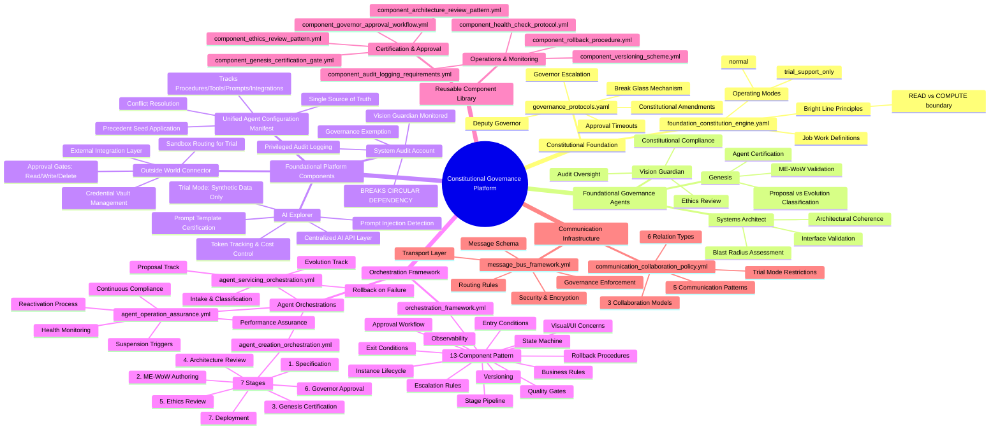

```mermaid
mindmap
  root((Constitutional Governance Platform))
    Constitutional Foundation
      foundation_constitution_engine.yaml
        Operating Modes
          normal
          trial_support_only
        Bright Line Principles
          READ vs COMPUTE boundary
        Job Work Definitions
      governance_protocols.yaml
        Governor Escalation
        Approval Timeouts
        Break Glass Mechanism
        Constitutional Amendments
        Deputy Governor
    
    Foundational Governance Agents
      Genesis
        Agent Certification
        ME-WoW Validation
        Proposal vs Evolution Classification
      Systems Architect
        Architectural Coherence
        Interface Validation
        Blast Radius Assessment
      Vision Guardian
        Constitutional Compliance
        Ethics Review
        Audit Oversight
    
    Foundational Platform Components
      AI Explorer
        Centralized AI API Layer
        Prompt Template Certification
        Token Tracking & Cost Control
        Prompt Injection Detection
        Trial Mode: Synthetic Data Only
      Outside World Connector
        External Integration Layer
        Credential Vault Management
        Sandbox Routing for Trial
        Approval Gates: Read/Write/Delete
      System Audit Account
        BREAKS CIRCULAR DEPENDENCY
        Privileged Audit Logging
        Governance Exemption
        Vision Guardian Monitored
      Unified Agent Configuration Manifest
        Single Source of Truth
        Tracks Procedures/Tools/Prompts/Integrations
        Precedent Seed Application
        Conflict Resolution
    
    Orchestration Framework
      orchestration_framework.yml
        13-Component Pattern
          Entry Conditions
          Stage Pipeline
          Quality Gates
          Approval Workflow
          State Machine
          Escalation Rules
          Exit Conditions
          Rollback Procedures
          Business Rules
          Observability
          Visual/UI Concerns
          Versioning
          Instance Lifecycle
      
      Agent Orchestrations
        agent_creation_orchestration.yml
          7 Stages
            1. Specification
            2. ME-WoW Authoring
            3. Genesis Certification
            4. Architecture Review
            5. Ethics Review
            6. Governor Approval
            7. Deployment
        agent_servicing_orchestration.yml
          Intake & Classification
          Proposal Track
          Evolution Track
          Rollback on Failure
        agent_operation_assurance.yml
          Health Monitoring
          Suspension Triggers
          Reactivation Process
          Performance Assurance
          Continuous Compliance
    
    Reusable Component Library
      Certification & Approval
        component_genesis_certification_gate.yml
        component_governor_approval_workflow.yml
        component_architecture_review_pattern.yml
        component_ethics_review_pattern.yml
      
      Operations & Monitoring
        component_health_check_protocol.yml
        component_rollback_procedure.yml
        component_versioning_scheme.yml
        component_audit_logging_requirements.yml
    
    Communication Infrastructure
      communication_collaboration_policy.yml
        5 Communication Patterns
        3 Collaboration Models
        6 Relation Types
        Trial Mode Restrictions
      message_bus_framework.yml
        Transport Layer
        Message Schema
        Routing Rules
        Security & Encryption
        Governance Enforcement
```
