# Constitutional Architecture - Tree View (Hierarchical)

**Updated:** 2026-01-07 - Post-Constitutional Amendment AMENDMENT-001 + Simulation Gap Fixes  
**Reflects:** L0→L1→L2→L3 governance layers, Industry Component, Vector DB routing, Agent DNA + Job/Skills model

```mermaid
graph TD
    CONST[CONSTITUTION<br/>Foundation.md<br/>Constitutional Engine v1.2]
    
    CONST --> L0[L0: IMMUTABLE PRINCIPLES<br/>5 Core Principles]
    
    L0 --> P1[No Human Harm]
    L0 --> P2[Transparent Reasoning]
    L0 --> P3[Constitutional Compliance]
    L0 --> P4[Governor Authority]
    L0 --> P5[Adaptive Learning]
    
    CONST --> L1[L1: STRUCTURE<br/>Governance Foundation]
    
    L1 --> AMEND[Amendment Process<br/>AMENDMENT-001: AI Agent DNA]
    L1 --> AGENTS[7 Foundational Agents<br/>Governance Layer]
    L1 --> CONTRACTS[Data Contracts<br/>data_contracts.yml]
    
    AGENTS --> GOV[Governor<br/>Human Approval Authority<br/>Emergency Budget + Pricing]
    AGENTS --> GEN[Genesis<br/>Certification Authority<br/>Job + Skill + Agent]
    AGENTS --> MGR[Manager<br/>Skill Orchestration<br/>Team Coordination]
    AGENTS --> HELP[Helpdesk<br/>Customer Support<br/>Trial Management]
    AGENTS --> ARCH[Systems Architect<br/>Monitoring + Budget<br/>Performance Tracking]
    AGENTS --> QA[Quality Assurance<br/>Future - Phase 4]
    AGENTS --> SEC[Security Agent<br/>Future - Phase 4]
    
    CONTRACTS --> STATE[agent_state_schema<br/>DNA + Memory + Cache]
    CONTRACTS --> JOB[job_definition_schema<br/>Industry + Geography + Skills]
    CONTRACTS --> SKILL[skill_execution_schema<br/>Think→Act→Observe]
    CONTRACTS --> IND[industry_schemas<br/>Embeddings + Cache]
    
    CONST --> L2[L2: OPERATIONS<br/>Runtime Components]
    
    L2 --> JOBREG[Job/Skills Registry<br/>PostgreSQL Tables<br/>Certified Jobs + Skills]
    L2 --> INDUSTRY[Industry Component<br/>5 Industries + Embeddings]
    L2 --> VDB[Vector DBs<br/>Query Routing]
    L2 --> CACHE[Agent Caches<br/>3 Types]
    
    INDUSTRY --> HC[Healthcare<br/>FDA + HIPAA + Medical]
    INDUSTRY --> EDU[Education<br/>FERPA + CBSE + Pedagogy]
    INDUSTRY --> FIN[Finance<br/>SOX + GAAP + SEC]
    INDUSTRY --> MKT[Marketing<br/>SEO + FTC + GDPR]
    INDUSTRY --> SALES[Sales<br/>Methodologies + CRM]
    
    VDB --> CONSTVDB[Constitutional Vector DB<br/>~50 chunks L0/L1/L2/L3<br/>Precedents + Protocols]
    VDB --> INDVDB[Industry Vector DB<br/>5 × 50K chunks<br/>Domain Knowledge]
    VDB --> ROUTING[Query Routing<br/>Constitutional vs Industry<br/>SIM-002 Fix]
    
    CACHE --> PREC[precedents.json<br/>Query Routing Cache<br/>Constitutional Queries]
    CACHE --> INDCACHE[industry_context.json<br/>Domain Knowledge Cache<br/>Specialists Only]
    CACHE --> SKLREG[skill_registry.json<br/>Certified Skills<br/>Version + Status]
    
    CONST --> L3[L3: LEARNING<br/>Precedent Seeds]
    
    L3 --> SEED1[GEN-002<br/>Amendment Proposal Seed<br/>Auto-Approve Pattern]
    L3 --> SEED2[GEN-004<br/>Healthcare Content Auto-Approval<br/>Governor 24hr Veto Window]
    L3 --> SEED3[Future Seeds<br/>Pattern Recognition<br/>Auto-Approval with Oversight]
    
    L3 -.Feedback Loop<br/>Learning.-> CONST
    
    style CONST fill:#667eea,stroke:#00f2fe,stroke-width:4px,color:#fff,font-size:16px
    style L0 fill:#10b981,stroke:#00f2fe,stroke-width:3px,color:#fff
    style L1 fill:#f59e0b,stroke:#00f2fe,stroke-width:3px,color:#fff
    style L2 fill:#ef4444,stroke:#00f2fe,stroke-width:3px,color:#fff
    style L3 fill:#8b5cf6,stroke:#00f2fe,stroke-width:3px,color:#fff
    style GOV fill:#ffe1f5,stroke:#f093fb,stroke-width:2px
    style GEN fill:#fff4e1,stroke:#f59e0b,stroke-width:2px
    style ROUTING fill:#00f2fe,stroke:#667eea,stroke-width:2px,color:#000
```



---

**How to View:**
- **GitHub**: This diagram renders automatically when viewing on GitHub
- **VS Code**: Install 'Markdown Preview Mermaid Support' extension, then preview this file
- **PNG/SVG**: Install mermaid-cli (`npm install -g @mermaid-js/mermaid-cli`) then run:
  ```bash
  mmdc -i diagram_graph.md -o diagram_graph.png
  ```
