# Constitutional Governance Architecture - Graph

```mermaid
graph TB
    subgraph Constitutional_Foundation[Constitutional Foundation]
        CE[constitution_engine]
        GP[governance_protocols]
    end
    
    subgraph Governance_Agents[Foundational Governance Agents]
        Genesis[Genesis]
        Architect[Systems Architect]
        Guardian[Vision Guardian]
        Governor[Platform Governor]
    end
    
    subgraph Platform_Components[Foundational Platform Components]
        AI[AI Explorer]
        Connector[Outside World Connector]
        Audit[System Audit Account]
        Manifest[Unified Manifest]
    end
    
    subgraph Orchestration[Orchestration Layer]
        Framework[orchestration_framework]
        Creation[agent_creation]
        Servicing[agent_servicing]
        Operations[agent_operation_assurance]
    end
    
    subgraph Components[Reusable Components - 8 total]
        GenGate[genesis_certification_gate]
        GovApproval[governor_approval_workflow]
        ArchReview[architecture_review_pattern]
        EthicsReview[ethics_review_pattern]
        Health[health_check_protocol]
        Rollback[rollback_procedure]
        Versioning[versioning_scheme]
        AuditLog[audit_logging_requirements]
    end
    
    subgraph Communication[Communication Infrastructure]
        CommPolicy[communication_collaboration_policy]
        MsgBus[message_bus_framework]
    end
    
    %% Constitutional Foundation influences everything
    CE -.-> Genesis
    CE -.-> Architect
    CE -.-> Guardian
    CE -.-> Governor
    CE -.-> AI
    CE -.-> Connector
    
    GP --> Governor
    GP --> Genesis
    
    %% Governance Agents use Platform Components
    Genesis --> Manifest
    Architect --> Audit
    Guardian --> Audit
    
    %% Platform Components depend on each other
    AI --> Audit
    AI --> Manifest
    Connector --> Audit
    Connector --> Manifest
    Audit -.->|monitors| AI
    Audit -.->|monitors| Connector
    
    %% Orchestrations reference Framework
    Framework --> Creation
    Framework --> Servicing
    Framework --> Operations
    
    %% Orchestrations use Components
    Creation --> GenGate
    Creation --> GovApproval
    Creation --> ArchReview
    Creation --> EthicsReview
    Creation --> Rollback
    Creation --> Health
    Creation --> Versioning
    Creation --> AuditLog
    
    Servicing --> GenGate
    Servicing --> GovApproval
    Servicing --> Rollback
    Servicing --> Versioning
    
    Operations --> Health
    Operations --> GovApproval
    Operations --> AuditLog
    
    %% Orchestrations use Platform Components
    Creation --> AI
    Creation --> Connector
    Servicing --> Manifest
    Operations --> Manifest
    
    %% Communication Infrastructure underlies everything
    MsgBus -.-> Genesis
    MsgBus -.-> Architect
    MsgBus -.-> Guardian
    MsgBus -.-> AI
    MsgBus -.-> Connector
    CommPolicy -.-> MsgBus
    
    %% Governance Agents oversee Orchestrations
    Genesis -.->|certifies| Creation
    Genesis -.->|classifies| Servicing
    Architect -.->|reviews| Creation
    Guardian -.->|audits| Operations
    Governor -.->|approves| Creation
    
    style CE fill:#ffe1e1
    style GP fill:#ffe1e1
    style Genesis fill:#fff4e1
    style Architect fill:#fff4e1
    style Guardian fill:#fff4e1
    style Governor fill:#ffe1f5
    style Audit fill:#e1f5e1
    style Manifest fill:#e1f5e1
```



---

**How to View:**
- **GitHub**: This diagram renders automatically when viewing on GitHub
- **VS Code**: Install 'Markdown Preview Mermaid Support' extension, then preview this file
- **PNG/SVG**: Install mermaid-cli (`npm install -g @mermaid-js/mermaid-cli`) then run:
  ```bash
  mmdc -i diagram_graph.md -o diagram_graph.png
  ```
