# Constitutional Architecture - Layer View (Constitution-Centric)

**Updated:** 2026-01-07 - Post-Constitutional Amendment AMENDMENT-001 + Simulation Gap Fixes  
**Reflects:** Concentric governance layers with Constitution at center, feedback loop L3→Constitution

```mermaid
graph TB
    subgraph L0["━━━━━━━━━━━━━━━━━━━━━━━━━━━━━━━━━━<br/>L0: IMMUTABLE PRINCIPLES<br/>━━━━━━━━━━━━━━━━━━━━━━━━━━━━━━━━━━"]
        P1[No Human Harm<br/>Physical + Psychological + Financial]
        P2[Transparent Reasoning<br/>Think→Act→Observe Logging]
        P3[Constitutional Compliance<br/>Vector Embedding + RAG]
        P4[Governor Authority<br/>Human Final Say]
        P5[Adaptive Learning<br/>Precedent Seeds + Feedback]
    end
    
    subgraph L1["━━━━━━━━━━━━━━━━━━━━━━━━━━━━━━━━━━<br/>L1: STRUCTURE<br/>━━━━━━━━━━━━━━━━━━━━━━━━━━━━━━━━━━"]
        AMEND[Amendment Process<br/>AMENDMENT-001 AI Agent DNA]
        
        GOV[Governor Agent<br/>External Execution Approval<br/>Emergency Budget + Pricing]
        GEN[Genesis Agent<br/>Certification Authority<br/>Job + Skill + Agent]
        MGR[Manager Agent<br/>Skill Orchestration<br/>Team Coordination]
        HELP[Helpdesk Agent<br/>Customer Support<br/>Trial Management]
        ARCH[Systems Architect Agent<br/>Monitoring + Budget<br/>Performance Tracking]
        
        CONTRACTS[Data Contracts<br/>agent_state + job_definition<br/>skill_execution + industry_schemas]
    end
    
    CONST["━━━━━━━━━━━━━━━━━━━━━━━━━━━━━━━━━━<br/>CONSTITUTION<br/>Foundation.md v1.2<br/>Constitutional Engine<br/>━━━━━━━━━━━━━━━━━━━━━━━━━━━━━━━━━━"]
    
    subgraph L2["━━━━━━━━━━━━━━━━━━━━━━━━━━━━━━━━━━<br/>L2: OPERATIONS<br/>━━━━━━━━━━━━━━━━━━━━━━━━━━━━━━━━━━"]
        JOBREG[Job/Skills Registry<br/>PostgreSQL<br/>certified_jobs + certified_skills]
        
        INDUSTRY[Industry Component<br/>5 Industries Built]
        HC[Healthcare: FDA + HIPAA]
        EDU[Education: FERPA + CBSE]
        FIN[Finance: SOX + GAAP]
        MKT[Marketing: SEO + FTC]
        SALES[Sales: Methodologies]
        
        VDB[Vector DBs + Query Routing]
        CONSTVDB[Constitutional Vector DB<br/>~50 chunks L0/L1/L2/L3]
        INDVDB[Industry Vector DB<br/>5 × 50K chunks domain knowledge]
        ROUTING[Query Routing SIM-002<br/>Constitutional vs Industry]
        
        CACHE[Agent Caches]
        PREC[precedents.json<br/>Constitutional queries]
        INDCACHE[industry_context.json<br/>Specialists only]
        SKLREG[skill_registry.json<br/>Certified skills]
    end
    
    subgraph L3["━━━━━━━━━━━━━━━━━━━━━━━━━━━━━━━━━━<br/>L3: LEARNING<br/>━━━━━━━━━━━━━━━━━━━━━━━━━━━━━━━━━━"]
        SEED1[GEN-002<br/>Amendment Proposal Seed<br/>Auto-Approve Pattern]
        SEED2[GEN-004<br/>Healthcare Content Auto-Approval<br/>24hr Governor Veto Window]
        SEED3[Future Seeds<br/>Pattern Recognition<br/>Auto-Approval with Oversight]
    end
    
    L0 --> CONST
    CONST --> L1
    L1 --> L2
    L2 --> L3
    L3 -.Feedback Loop<br/>Learning + Pattern Recognition.-> CONST
    
    INDUSTRY --> HC
    INDUSTRY --> EDU
    INDUSTRY --> FIN
    INDUSTRY --> MKT
    INDUSTRY --> SALES
    
    VDB --> CONSTVDB
    VDB --> INDVDB
    VDB --> ROUTING
    
    CACHE --> PREC
    CACHE --> INDCACHE
    CACHE --> SKLREG
    
    style CONST fill:#667eea,stroke:#00f2fe,stroke-width:6px,color:#fff,font-size:18px
    style L0 fill:#10b981,stroke:#00f2fe,stroke-width:4px,color:#fff
    style L1 fill:#f59e0b,stroke:#00f2fe,stroke-width:4px,color:#fff
    style L2 fill:#ef4444,stroke:#00f2fe,stroke-width:4px,color:#fff
    style L3 fill:#8b5cf6,stroke:#00f2fe,stroke-width:4px,color:#fff
    style GOV fill:#ffe1f5,stroke:#f093fb,stroke-width:2px
    style GEN fill:#fff4e1,stroke:#f59e0b,stroke-width:2px
    style ROUTING fill:#00f2fe,stroke:#667eea,stroke-width:2px,color:#000
```



---

**How to View:**
- **GitHub**: This diagram renders automatically when viewing on GitHub
- **VS Code**: Install 'Markdown Preview Mermaid Support' extension, then preview this file
- **PNG/SVG**: Install mermaid-cli (`npm install -g @mermaid-js/mermaid-cli`) then run:
  ```bash
  mmdc -i diagram_mindmap.md -o diagram_mindmap.png
  ```
